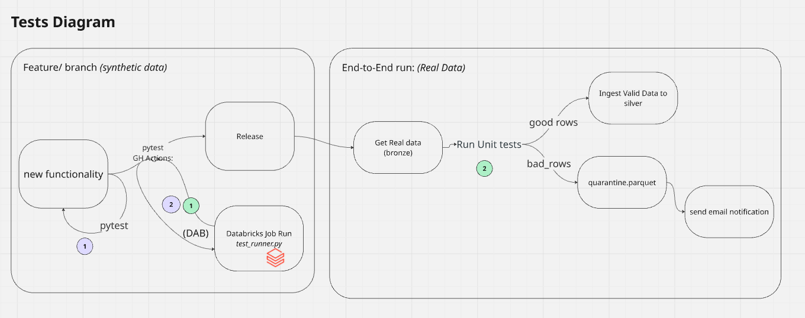
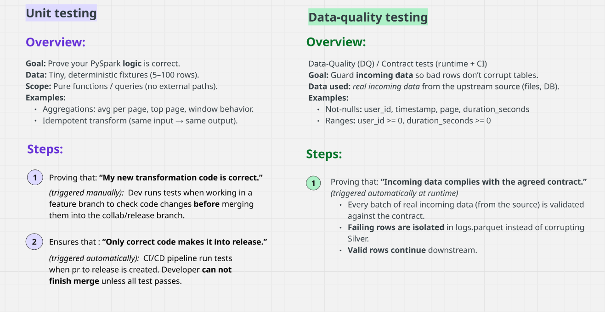

# User Engagement Analysis

## Overview
This project demonstrates a PySpark solution for analyzing user engagement data and enforcing data quality (DQ) checks, following **PEP-8**, **OOP principles**, and **TDD**.


## Tech Stack
- Compute: Databricks
    - PySpark (3.5)
    - Databricks Runtime 16.4 
- File Storage: 
    - DBFS
- Dependencies:
    - Pytest (8.4)  
- CI/CD: 
    - GitHub Actions + Databricks CLI (bundles)


## Project Structure

```
user-engagement-analysis/
│
├── .github/workflows/              # CI/CD workflow configuration
│   └── test_on_databricks.yml      # GitHub Actions workflow for Databricks tests
│
├── assets/                         # Documentation images and diagrams
│
├── src/                            # Source code for engagement analysis
│   └── engagement.py               # EngagementAnalysisProcessor class and related logic
│
├── tests/                          # Unit and data quality tests
│   ├── test_data_quality.py         # UserEngagementDQ class and test cases for data validation
│   ├── test_unit.py                # Unit tests for transformation logic
│   └── conftest.py                 # Pytest configuration and fixtures
│
├── .gitignore                      # Git ignore rules
├── README.md                       # Project overview and instructions
├── databricks.yml                  # Databricks bundle job configuration
├── nb_engagement_analysis.ipynb    # Main notebook for analysis and testing
├── requirements.txt                # Python dependencies for the project
├── test_runner.py                 # Entrypoint for running tests on Databricks
```


## Testing Diagram






